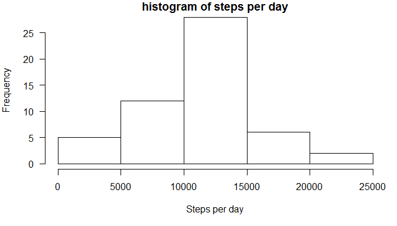
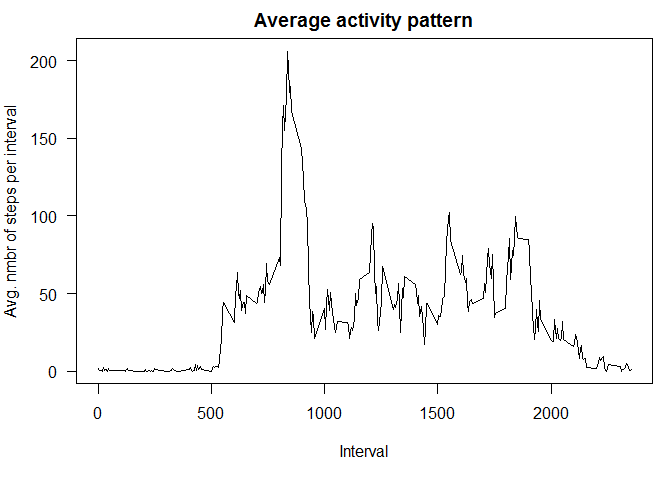
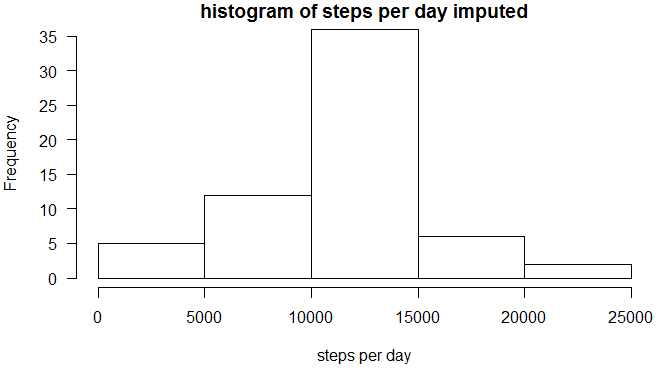

# Reproducible Research: Peer Assessment 1

## Loading and preprocessing the data
This process assumes that the zip-file is located in the working directory of R

```r
data <- read.csv(unzip("activity.zip","activity.csv"))
```

## What is mean total number of steps taken per day?
To calculate this we first create a vector with number of steps totalled per day

```r
        stepspd <- tapply(data$steps,data$date,FUN=sum)
```
Below is a histogram of the total number of steps taken per day

```r
        par(mar=c(5,4,1,1),las=1)
        hist(stepspd,main="histogram of steps per day",xlab="Steps per day")
```

 

```r
        meansteps <- as.integer(mean(stepspd,na.rm=TRUE))
        mediansteps <- as.integer(mean(stepspd,na.rm=TRUE))
```

The mean of the number of steps per day is 10766
The median of the number of steps per day is 10766

## What is the average daily activity pattern?

First we need to calculate the average nummber of steps per interval across all days and add the interval identifier, then combine them into a table and plot it.


```r
        avgstepspint <- tapply(data$steps,data$interval,FUN=mean,na.rm=TRUE)
        Interv  <- unique(data$interval)
        meanstepspint <- as.data.frame(cbind(avgstepspint,Interv))
        par(mar=c(5,4,2,1),las=1)
        plot(Interv,avgstepspint,type="l",main="Average activity pattern",xlab="Interval",ylab="Avg. nmbr of steps per interval")
```

 

To determine the interval with the maximum average number of steps, this code is used:

```r
        maxint <- which.max(avgstepspint)
        interval <- Interv[maxint]
```

The interval which contains the maximum number of steps is 835

## Imputing missing values

```r
        incomplete <- data[!complete.cases(data),]
        nbrmissing <- nrow(incomplete)
```
The number of observations with missing data is 2304

A new data set "data2"is created which has its missing values imputed.
Missing values for steps per interval are replaced with the mean number of steps for that particular interval across all days.


```r
        data2 <- data
                for(i in 1:nrow(data2)){
                if(is.na(data2$steps[i])){
                        data2$steps[i] <- meanstepspint$avgstepspint[match(data2$interval[i],meanstepspint$Interv)]
                }
        }
rm(i)
```

To see if there is a difference between the "raw" data and the data with imputed values for NA's, we calculate the mean, median and histogram for the imputed data set.


```r
        stepspd2 <- tapply(data2$steps,data2$date,FUN=sum)
        meansteps2 <- mean(stepspd2,na.rm=TRUE)
        mediansteps2 <- median(stepspd2,na.rm=TRUE)
```
Below is a histogram of the total number of steps taken per day

```r
        par(mar=c(5,4,1,1),las=1)
        hist(stepspd2,main="histogram of steps per day imputed",xlab="steps per day")
```

 


```r
        meansteps2 <- as.integer(mean(stepspd2,na.rm=TRUE))
        mediansteps2 <- as.integer(median(stepspd2,na.rm=TRUE))
```

The mean of the number of steps per day after imputation is 10766
The median of the number of steps per day after imputation is 10766

The difference of mean, median and histogram of number of steps before and after imputation of NA values of "steps" can be neglected, therefore imputing data for missing values in this case does not have any impact. 

## Are there differences in activity patterns between weekdays and weekends?
